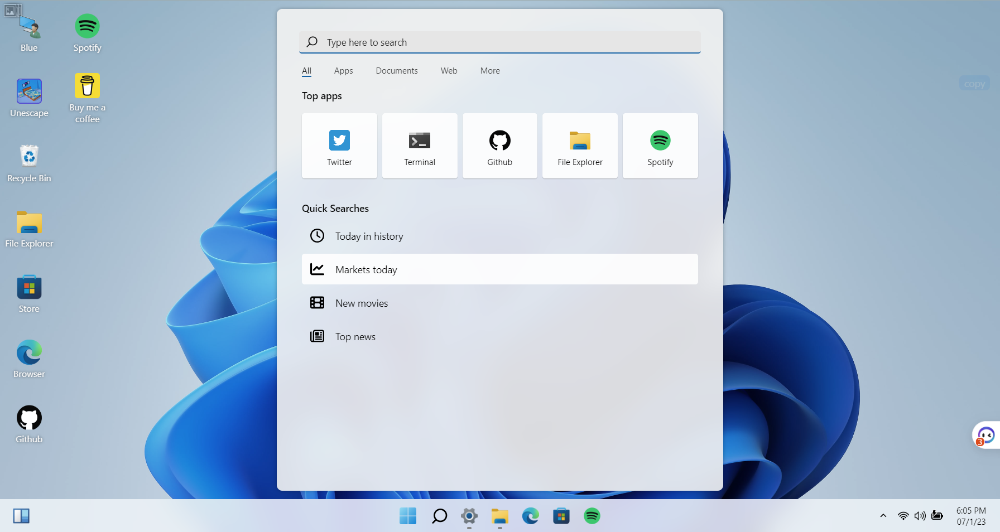

# 技术技术
##  嵌入式通讯协议的小结
对于嵌入式常见的通讯协议娓娓道来，深感大学学习时细节究的太多，面铺得太开，而不懂得如何抽象。
https://www.bilibili.com/video/BV1ju411W7Q3/

# 有趣的工具
## Chat2DB
- [Chat2DB](https://github.com/chat2db/Chat2DB/blob/main/README_CN.md) 是一款集成了AIGC的能力多数据库客户端工具。
  和传统的数据库客户端软件Navicat、DBeaver 相比Chat2DB集成了AIGC的能力，能够将自然语言转换为SQL，也可以将SQL转换为自然语言，可以给出研发人员SQL的优化建议，极大的提升人员的效率，是AI时代数据库研发人员的利器，未来即使不懂SQL的运营业务也可以使用快速查询业务数据、生成报表能力。目前支持windows、mac本地安装，也支持服务器端部署，web网页访问。

## V2EX Polish
- [V2EX_Polish](https://github.com/coolpace/V2EX_Polish) 是 一款增强 V2EX 的浏览器插件，其提供了丰富的扩展功能，让原生页面焕然一新。
  

## Win11 体验工具
-  [Win11 in React](https://github.com/blueedgetechno/win11React) 是一个基于React框架构建的Windows 11仿真器，它可以在网页中模拟出Windows 11的用户界面和交互方式。
  Win11 in React的开发者使用了React框架和其他一些Javascript库来实现这个仿真器。在这个仿真器中，用户可以看到Windows 11的桌面、开始菜单、任务栏、应用程序、设置界面等等，而且这些界面和交互方式都可以在网页中完美地呈现出来。
  如果你正在 犹豫要不要升级到 win11，那么可以先试用下看看习不习惯。
  体验地址：[https://win11.blueedge.me/](https://win11.blueedge.me/)
  
  

## Z-Library
- Z-Library 推出适用于 Windows 和 macOS 的桌面启动器的 alpha 版本！这个启动器将为您省去搜索有效网站链接的麻烦，为您处理一切。
  - 下载适用于 Windows 的 Z-Library 应用程序  (https://go-to-zlibrary.se/#desktop_app_tab)
  - 下载适用于 macOS 的 Z-Library 应用程序  (https://go-to-zlibrary.se/#desktop_app_tab)
  - 下载适用于 Android 的 Z-Library 应用程序 (https://go-to-zlibrary.se/#android_app_tab
  - tg: https://t.me/zlibrary_official

# 宝藏信息
## iOS信息源
形式和流程比较规范，内容对于iOS了解不是很多，建议@惜夏 @胡苏 给出意见
[SwiftOldDriver/iOS-Weekly: 🇨🇳 老司机技术 iOS 周报 (github.com)](https://github.com/SwiftOldDriver/iOS-Weekly)

## Modern C++
[Modern C++](https://github.com/lkimuk/the-book-of-modern-cpp) 是一本开源的C++电子书。含十大主题，分为 Basics、Modern C++、C++23、Metaprogramming、Concurrency、Performance、Algorithms、Techniques、Tricks 和 Miscellaneous。广度少有能及，又因作者众多，深度亦有保证，加之内容甚新，录有 C++26/29 才有可能加入的特性，值得反复阅读。

# 资讯
- 亚马逊中国（amazon.cn）通过邮件向 Kindle 用户发送了关于“[Kindle 中国电子书店将于 2023 年 6 月 30 日停止运营](https://bookfere.com/post/982.html)”的业务调整通知。需要将Kindle商店购买的电子书备份到本地的朋友可以看这篇教程。[https://bookfere.com/post/983.html](https://bookfere.com/post/983.html)

- [MobileSAM](https://github.com/ChaoningZhang/MobileSAM) 为面向移动端的轻量级SAM，比FastSAM快4倍，分割一张图像仅需10ms。
  该项目每张图像的运行时间约为10毫秒：图像编码器为8毫秒，蒙版解码器为2毫秒。凭借卓越的性能和更高的可变性，MobileSAM比同类的FastSAM小7倍，快4倍，更适合移动应用程序。
  MobileSAM论文可在[ResearchGate](https://www.researchgate.net/publication/371851844_Faster_Segment_Anything_Towards_Lightweight_SAM_for_Mobile_Applications)和[arXiv](https://arxiv.org/pdf/2306.14289.pdf)上找到。代码可以在[MobileSAM](https://github.com/ChaoningZhang/MobileSAM) 找到。
	

# 后记
百闻不如一见，百见不如一试。