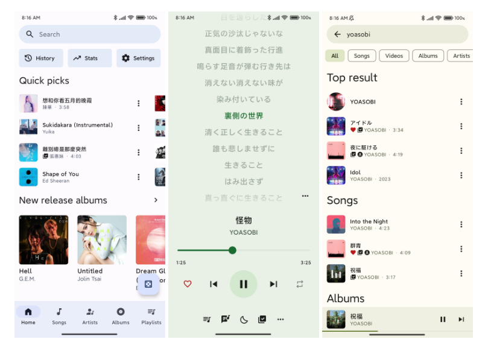
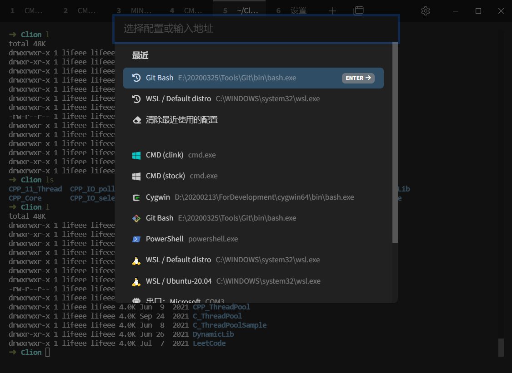
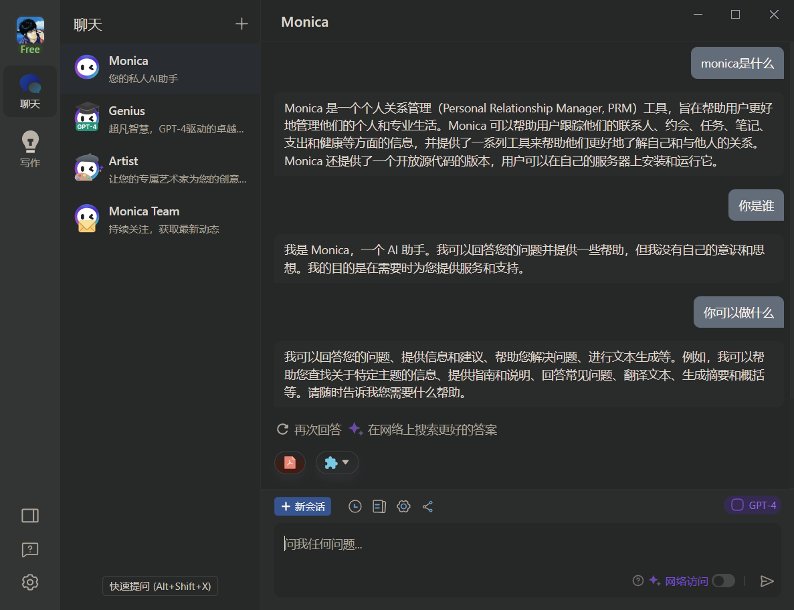
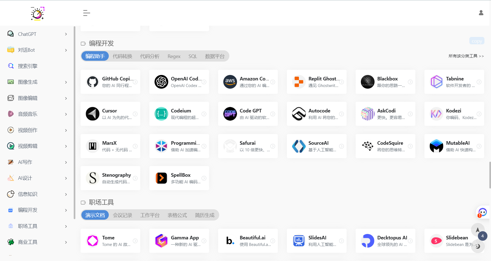

大家好，欢迎来到我们的第三期分享。在这个炎炎夏日里，我们又准备了一些有趣的技术、工具、信息和资讯，希望能够给大家带来一些清凉和启发。虽然天气炎热，但我们的热情依旧不减，让我们一起开启这次的分享之旅吧！

# 技术技术

### InnerTune

[InnerTune](https://github.com/z-huang/InnerTune) 是一款Material 3风格的Android 端 YouTube Music APP。可以根据专辑封面的动态获取颜色，界面看起来非常舒服，Android端还没使用过Material Design的同学不妨学习学习。

### Final2x

[Final2x ](https://github.com/Tohrusky/Final2x)可以使用RealCUGAN、RealESRGAN、Waifu2x和SRMD这几种模型将图像超分辨率到任意尺寸，以提高图像的分辨率和质量，使其更清晰和更详细。下载链接：[https://github.com/Tohrusky/Final2x/releases](https://github.com/Tohrusky/Final2x/releases ) ， [安装说明可看这里](https://github.com/Tohrusky/Final2x/blob/main/README_i18n/README_zh.md)。

### 一次理清Android对导航栏和状态栏的控制

[Android Detail：Window 篇—— WindowInsets 与 fitsSystemWindow](https://juejin.cn/post/7038422081528135687)介绍了 Android 中的 WindowInsets 和 fitsSystemWindows 两个 API，以及它们的作用。WindowInsets 描述了一组 Window Content 的 Insets，即屏幕上除了应用程序绘制的内容外，还有系统的 Insets 区域；而 fitsSystemWindows 可以通过 padding 为 System bar 预留出空间，处理视觉冲突。本文还详细介绍了如何适配 edge-to-edge，如何获取 System bar 和软键盘的高度，以及如何设置 System bar 前景颜色等内容。

[https://juejin.cn/post/7038422081528135687](https://juejin.cn/post/7038422081528135687)

# 有趣的工具

### tabby

[Tabby](https://tabby.sh/) 是一款开源的现代化的终端，支持在 Windows、Mac 和 Linux 上运行。下载地址： [https://github.com/Eugeny/tabby/releases](https://github.com/Eugeny/tabby/releases)

- 集成 SSH，Telnet 

- 集成串行终端

- 可定制主题和配色方案

- 完全可配置的快捷键

- 分体式窗格

- 自动保存标签页

- 支持 PowerShell（和 PS Core）、WSL、Git-Bash、Cygwin、MSYS2、Cmder 和 CMD

- 在 SSH 会话中通过 Zmodem 进行直接文件传输

- 完整的 Unicode 支持，包括双角字符

  

### clipdrop 

[clipdrop.co/tools](https://clipdrop.co/tools) 含 9 个功能强大的 AI 图像工具，擦除图像元素、一件抠图、图像打光、AI 绘画等等.

### Monica 

**Monica** (莫妮卡) 是一款由 ChatGPT 驱动的 **AI 浏览器插件**扩展工具！它不仅**能直连**，无需你提供 Key，而且还能**在所有网页上使用**。按下 Ctrl+M 即可开始聊天、问答、让 AI 撰写文案等；并且当选中[网页](http://mp.weixin.qq.com/s?__biz=MjM5NjExODEyMA==&mid=2247499409&idx=2&sn=79fc9574261fa7ba08c4f3efe5cee52c&chksm=a6ec9596919b1c80df31e7e37a2f3924073d53478822e96181c2376c661e1869534260bb2b32&scene=21#wechat_redirect)文本后，还会显示快捷菜单，帮你解释其内容、[翻译](http://mp.weixin.qq.com/s?__biz=MjM5NjExODEyMA==&mid=2247498275&idx=1&sn=aa605fc627aa65267f1a30b9520344f0&chksm=a6ec9124919b18325a813d60b75c37edf2661726e6cb4f581cce8e9cb809dab73d6be6441257&scene=21#wechat_redirect)、写总结等，非常方便。现在已经有了Windows和Mac桌面端，下载地址：[https://monica.im/desktop#installation](https://monica.im/desktop#installation)

# 宝藏信息

### WeChat_Article

[WeChat_Article](https://github.com/1061700625/WeChat_Article) 可以爬取微信公众号文章，前提是需要申请一个免费的微信公众号，然后用公众号搜公众号进行文章抓取。

### SownAI

[SownAI](https://sownai.com/) 是一个关于 AI 工具与资源的导航网站，包括对话Bot、搜索引擎、图像编辑、音视频创作、AI写作等等。

### Sweep

[sweep](https://github.com/sweepai/sweep) 是一款利用AI对Github仓库进行代码审查 (Code Review)的工具。 支持的语言：Python，Javascript/Typescript，Rust，Go，Java / C#，C++以及GPT-4支持的任何其他语言

# 资讯

- OpenAl宣布；GPT-4的API现在对所有付费用户开放，无需申请。此外，GPT-3.5Turbo、DALL·E和Whisper API也已全面开放。 [openai.com](https://openai.com/blog/gpt-4-api-general-availability)
- [[2306.17840\] Statler: State-Maintaining Language Models for Embodied Reasoning (arxiv.org)](https://arxiv.org/abs/2306.17840) 提出了一个新的框架 Statler，提高了现有大模型在更长的时间范围内推理的能力，而不受上下文长度的限制。

# 后记

百闻不如一见，百见不如一试。

感谢 @惜夏 @羡仙 对本期客周求剑的贡献。